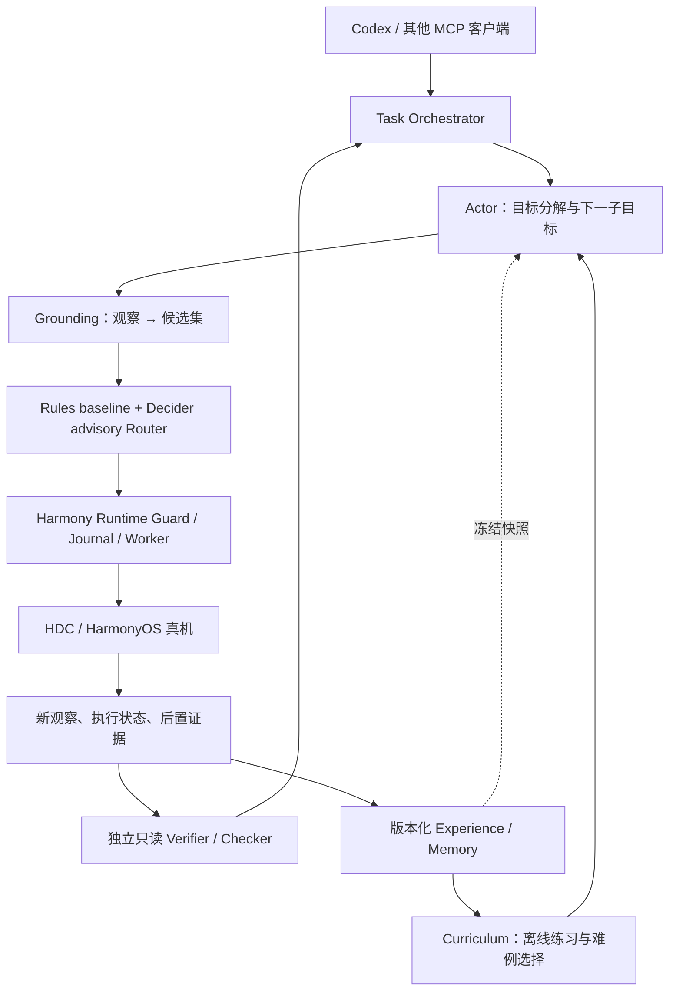
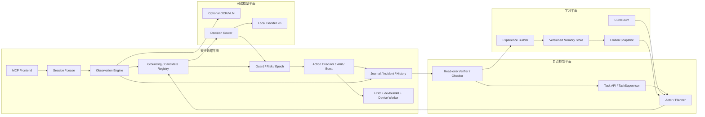
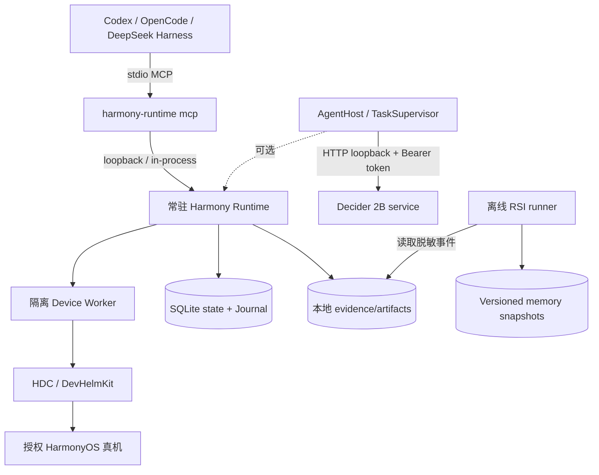

# HarmonyOS Runtime × RSIAgent × Decider 架构与开发计划

日期：2026-09-20  
基线：`feat/runtime-foundation` @ `578265754403b320e6d36355905450855c2e4f75`  
参考实现：本地 `D:\music mv\RSIAgent` @ `a9e56263f6deaa493496ad6b155fe24bf131bc12`

## 结论

采用“安全执行内核 + 上层自治学习 + 可插拔决策建议”的分层架构：



Harmony Runtime 继续拥有唯一的设备执行权、风险判断、过期检查、幂等日志和未知写入屏障。RSIAgent 的 Actor、Verifier、Curriculum、wave barrier 和 frozen memory 只作为上层协议与生命周期借鉴。Decider 只负责在已生成的候选集内给出 choice/noul 建议，不能产生坐标、原始动作、授权或绕过 Guard 的路径。

## 证据判断

* Harmony 当前已有六个 v1 直接工具、可选 AgentHost、TaskSupervisor、只读 Checker、Memory、候选注册表、Router 和 Journal；AgentHost 只通过 Runtime 公共会话 API 执行，安全链路没有暴露设备驱动。
* 本分支离线回归为 675 项通过；最新文档仍把正式 M0（每原语 100 次）、单批 M1 30 次、复杂真机任务和未知写入对账列为未完成门槛。
* 本机 Decider 为 `Mapika/decider-2b` 固定 revision `7789eb65d5cf519737608e218fa88819bddea0af`，loopback、单并发、15 秒期限、choice/noul 接口。45 条真实中文鸿蒙/微博状态的规则覆盖率为 86.7%、错误放行 0；Decider 覆盖率为 0%，影子 12 条状态与规则一致率为 0，故准入结论是 `keep_shadow_only`。
* RSIAgent 的强项是三角色闭环：Actor 执行，Verifier 独立检查，Curriculum 选择练习；Phase 1 广度探索有 wave memory barrier，Phase 2 针对失败/脆弱成功做深度练习，Phase 3 使用冻结记忆。它的参考环境允许执行 Python/Bash 并使用 VM 回滚，这些权限和回滚假设不能直接带入手机 Runtime。

## 角色与边界

| 角色 | 建议职责 | 明确禁止 |
|---|---|---|
| Actor | 读取冻结记忆和 Runtime 观察，生成 `TaskSubmit`/子目标与候选意图 | 直接访问 HDC、坐标、任意 Python/shell、修改安全策略 |
| Grounding | 依据当前 observation 生成有 TTL 的候选集和身份依据 | 静默选择歧义目标、复用旧 observation |
| Rules | 处理单候选、稳定身份和控制退出等确定性情况 | 调用模型、发明候选 |
| Decider | 对 2–16 个已注册候选或有限命题做 shadow/ranking | 直接 dispatch、返回坐标、决定高风险授权 |
| Runtime Guard/Journal | 唯一派发入口；做 lease、epoch、风险、幂等、unknown-write 和后置验证 | 被上层模型绕过 |
| Verifier/Checker | 只读地依据新 observation 和证据给出 pass/fail/inconclusive | 持有写工具、自行修复、把 inconclusive 算成功 |
| Curriculum | 在离线/受控练习集选择信息量高的任务，管理练习预算 | 直接判定设备动作成功、直接改 Actor 记忆 |
| Memory | 保存带 evidence ref、适用 App/build、前置条件、失败模式和风险级别的版本化经验 | 在在线执行中隐式自更新 |

## 当前最合适的开发顺序

### P0：完成设备执行底座与发布阻塞项

先完成新 RC 的 Stage 3 offline regression、M0 每原语 100 个有效样本、同一冻结代码的一批 M1 30 次、Burst/Wait 真机裁决，以及未知写入可信对账、取消/重启和隐私配额验收。修复项必须保持 stale guard、TTL、journal barrier 和“不确定写入不重试”。在 P0 完成前不把时间投入 Decider 精度优化或长任务学习。

### P1：冻结三层协议和观测证据

在 `harmony_agent` 增加稳定的 `Intent → CandidateSet → DecisionSuggestion → GuardedAction` 契约，并把 `observation_id`、`candidate_set_hash`、`controller_epoch`、`model_revision`、`calibration_version`、`evidence_refs` 写入事件。把 Actor 输出限制为结构化 Task/子目标，复用现有 RuntimeFacade/TaskSupervisor/ReadOnlyChecker。

### P2：接入 RSIAgent 式移动学习闭环（先模拟、后低风险真机）

新增独立的 mobile RSI orchestrator，而不是复制 RSIAgent 的 VM/benchmark 代码：

1. Phase 1：从同一 memory snapshot 并行跑 mock/fake device 练习；每个分支先经只读 Verifier，完整 wave 后按固定顺序合并经验。
2. Phase 2：真实目标失败或脆弱成功后，只选择低风险、可回滚到“重新观察/停止”的练习；每次练习完成验证后再提交下一版 memory。
3. Phase 3：在线任务只挂载经过 hash 的 frozen memory；禁用 Curriculum 和 memory write-back，任务结束后再离线审查。

移动经验条目至少包含：App/build 范围、前置页面事实、目标语义和稳定身份、候选生成层、动作风险、期望后置条件、成功/失败/停止条件、证据引用、有效期和版本 hash。

### P3：Decider 真实数据与校准

先修正真实状态渲染和候选描述，再采集至少 300、优选 500–1000 条按 App/任务/轨迹分组的真实 decision states；规则、当前 revision、新 revision（必要时小型 LLM）做同一对照。记录 coverage、wrong-allow、abstention、Brier/ECE、P50/P95、模型调用减少量和端到端任务成功率变化。继续保持 `local_off`/`local_shadow`，只有 holdout 达到零错误放行、校准有效、任务成功率不下降且延迟在预算内，才允许低风险 `local_canary`；canary 只放行低风险候选并保留自动回退。

### P4：长任务与客户端验收

补齐 checkpoints、上下文压缩和 evidence-index 召回；在冻结 memory 下做 50/100 步跨页任务，再做 300 次正式分组验收。最后完成 Codex/OpenCode/DeepSeek Harness 的 client-agnostic 对照、干净环境安装/升级/回滚和发布文档。

## 不建议的方案

1. 不把 RSIAgent 直接作为 Harmony Runtime 的依赖：它依赖 Linux/VM/benchmark 运行假设，且 Actor 的任意程序执行模型与手机写入安全边界冲突。
2. 不让 Decider 取代 rules、Grounding 或 Guard；当前真实数据已证明它还不能承担在线执行决策。
3. 不在在线任务中持续写 memory；手机没有通用回滚，错误经验会跨任务污染后续执行。
4. 不先做控制台、并行多设备或模型时延优化；当前发布阻塞仍是真机稳定性、未知写入对账、正式任务样本和真实决策数据。

## 主要风险与门槛

* **错误记忆**：Verifier 必须独立、只读，memory commit 必须有证据引用和版本 hash；任何 `inconclusive` 都不能合并为成功经验。
* **动态页面**：继续保守拒绝 stale/歧义目标；RSI 不能用重复尝试掩盖 grounding 缺陷。
* **模型不可用**：Decider 超时、503、revision/schema 错误统一回退 rules；外部 Actor/Verifier 不可用时 Runtime 仍可独立提供六个 v1 工具。
* **数据泄露**：经验只保留脱敏元数据和证据引用，原始页面/截图/输入按本地 retention 策略管理，不进入 Git。

验收顺序应始终是：Runtime 安全门槛 → 只读验证闭环 → 冻结记忆复用 → Decider 低风险 canary → 长任务与多客户端。任何上层成功率提升都不能覆盖底层安全门槛失败。

---

## 1. 设计目标、非目标和约束

### 1.1 目标

1. 在 Windows 主机上为 HarmonyOS 真机提供稳定、可审计、可恢复的 MCP 操作能力。
2. 让外部 Agent 能执行跨页面任务，同时把所有设备写入限制在 Runtime 的安全契约内。
3. 用 RSIAgent 的经验闭环积累“页面事实、定位线索、失败模式和验证方法”，而不是在线修改模型权重。
4. 让 Decider 在不改变安全边界的前提下减少候选歧义和外部模型调用。
5. 支持规则、Decider、外部 Actor、内部 Actor 逐步替换，任何一个模型服务故障都不影响基础 Runtime。

### 1.2 非目标

* 不把手机变成可执行任意 Python/shell 的沙箱。
* 不承诺任意 HarmonyOS 版本、任意 App、任意动态页面都能操作。
* 不把模型输出当作授权，不允许模型返回坐标绕过候选注册和 stale guard。
* 不在在线任务中自动写入全局经验库。
* 不把 RSIAgent 的 OSWorld/ALE VM、benchmark grader 或 Linux 运行时移植到手机 Runtime。

### 1.3 硬约束

| 约束 | 设计含义 |
|---|---|
| Runtime 是唯一设备写入口 | Actor、Decider、Verifier、Curriculum 都不能持有 HDC 或设备驱动 |
| 观察有时效性 | 所有动作绑定 `session_id + observation_id + controller_epoch`；过期必须重新观察 |
| 动作结果可能未知 | `prepared → dispatched → verified/unknown` 必须可持久化，unknown 禁止盲重试 |
| 动态页面不稳定 | 图树/截图/前台身份/目标子树不一致时拒绝派发 |
| 无通用设备回滚 | 学习只能提交低风险、可证据验证的经验；不可假设“重试即可恢复” |
| 本地模型可离线或忙碌 | Decider 超时、503、schema 错误统一回退规则基线 |
| 数据可能含隐私 | 原始树、截图、输入、token 留在本地 retention 区，不进 Git 和普通日志 |

## 2. 总体架构

### 2.1 三平面设计



* **安全数据平面**必须能脱离自治层独立运行，继续提供六个 v1 MCP 工具。
* **自治控制平面**只编排任务和子目标，所有动作仍回到数据平面。
* **学习平面**默认离线或受控运行，生成版本化 memory snapshot，不直接修改在线任务。
* **模型平面**全部可插拔，模型不可用时由规则和人工/外部 Agent 接管。

### 2.2 部署拓扑



部署原则：单台设备由一个 Runtime 持有写租约；多个 MCP 客户端共享 Runtime，不各自启动 HDC；Decider 是独立本机进程，默认不随 Runtime 自动拉起；RSI runner 不与手机动作进程共享写权限。

## 3. 组件详细设计

### 3.1 MCP Frontend

保留现有六个工具：`mobile_session`、`mobile_observe`、`mobile_act`、`mobile_wait`、`mobile_burst`、`mobile_history`。自治工具只在 `HARMONY_AGENT_TOOLS=1` 时注册：`mobile_run_task`、`mobile_task_status`、`mobile_task_cancel`、`mobile_task_events`、`mobile_decide`。

Frontend 只做 schema 校验、认证、调用 Runtime/AgentHost 和响应脱敏，不做模型调用、不缓存可执行目标、不自动重试写操作。stdout 仅输出 MCP 协议；日志写 stderr 或本地日志文件。

### 3.2 Session / Lease / Epoch

Session 状态建议固定为：

```text
NEW → OPENING → READY → PAUSED → RECOVERING → READY
                         └→ CLOSING → CLOSED
```

每次暂停、恢复、设备重连、前台身份重大变化都递增 `controller_epoch`。队列中的动作必须携带创建时 epoch，派发前重新检查；epoch 不一致直接返回 `stale_controller_epoch`，不得尝试补发。

### 3.3 Observation Engine

Observation 是不可变、带时间戳的事实包：

```json
{
  "observation_id": "obs_x",
  "session_id": "sess_x",
  "controller_epoch": 4,
  "captured_at": 0,
  "expires_at": 0,
  "screen": {"on": true, "locked": false, "size": [1080, 2340], "rotation": 0},
  "foreground": {"bundle": "com.example.app", "evidence": "verified"},
  "tree_fingerprint": "sha256:...",
  "display_fingerprint": "sha256:...",
  "catalog": [],
  "image_ref": "local-artifact:...",
  "capabilities": {"tree": true, "image": true, "som": true},
  "actionable": true
}
```

FAST 只提供最小目录和状态；FULL 才允许生成完整树、原始图和 SoM；TEMPORAL 历史帧永远不能直接用于动作。所有模型输入都由 observation 派生，不能从模型反向生成 observation。

### 3.4 Grounding / Candidate Registry

Grounding 分层顺序：

1. 稳定 `resource_id` / accessibility identity；
2. 精确文本 + 类型 + 可点击祖先；
3. 树结构关系和页面身份；
4. OCR/CV/VLM 只产生候选建议；
5. 任何层都必须回到当前 observation 的候选注册表。

每个候选包含 `candidate_id`、`target_ref`、描述、来源层、风险等级、TTL、预期 predicate 和候选子树 fingerprint。模型只能返回注册的 `candidate_id` 或控制项 `cand_none_applicable`、`reobserve`、`escalate`。

### 3.5 Decision Router

```text
RulesProvider
  ├─ 单候选 / 唯一稳定身份：可直接给出执行建议
  └─ 歧义 / 无候选：reobserve 或 escalate

Optional FastProvider (Decider)
  ├─ local_off：不构造、不调用
  ├─ local_shadow：调用并记录，不派发
  └─ local_canary：必须有校准 artifact，只允许低风险执行
```

Router 必须记录 provider revision、calibration version、候选 hash、confidence、certainty、fallback reason 和 latency。任何 provider 异常都降级到 rules，不能让模型故障传播为 Runtime 故障。

### 3.6 Guard / Action Executor

动作执行顺序固定为：

```text
参数校验
→ session/lease/epoch 检查
→ observation 新鲜度检查
→ 当前页面重新定位
→ target fingerprint / foreground / screen 状态检查
→ risk / authorization 检查
→ Journal prepared
→ Device Worker dispatch
→ Journal dispatched
→ 新观察
→ postcondition verification
→ verified / failed / execution_unknown
```

R0 只读、R1 普通导航默认允许；R2 修改设置或数据按会话策略；R3 发送、删除、支付、提交等默认拒绝或要求 Runtime 可信授权。模型传入的 `approved=true` 永远不是授权凭据。

### 3.7 AgentHost / TaskSupervisor

TaskSupervisor 负责任务去重、预算、状态、事件和结果事务；TaskRun 只持有 `RuntimeFacade`，不持有设备驱动。任务状态建议统一为：

```text
ACCEPTED → RUNNING → PAUSED → RUNNING
             ├→ SUCCEEDED
             ├→ PARTIAL
             ├→ FAILED
             ├→ CANCELLED
             └→ RECONCILIATION_REQUIRED
```

`RECONCILIATION_REQUIRED` 必须与最终 result 在同一个 SQLite 事务中提交，任何客户端都不能看到“已有终态但没有结果”的窗口。

### 3.8 Actor

Actor 的输入是任务目标、约束、当前 observation、可检索 frozen memory 和最近事件；输出只能是：

* 下一子目标；
* 结构化 grounding intent；
* 预期后置条件；
* 停止、重新观察、请求人工处理或等待。

Actor 不接触 `HARMONY_HDC`、设备序列号、token、原始 SQLite，不生成任意 shell/Python。可使用外部模型或本地模型，但必须通过统一 `ActorProvider` 协议。

### 3.9 Verifier / Checker

Verifier 分为两级：

* **代码 Checker**：前台 bundle、文本、输入值、选择态、页面变化、incident 等确定性 predicate。
* **独立语义 Verifier**：必要时读取脱敏截图/树和任务约束，输出 `pass/fail/inconclusive`；没有写工具，也不能读取 Actor 私有推理或未发布 memory。

Verifier 的结论只负责验证当前候选，不负责授权下一次写入；`inconclusive` 必须触发重新观察、人工处理或停止。

### 3.10 Memory / Experience

经验对象：

```json
{
  "experience_id": "exp_...",
  "scope": {"app": "...", "build": "...", "device_capability": "..."},
  "trigger": {"foreground": "...", "facts": [], "goal_pattern": "..."},
  "grounding": {"layers": ["resource_id", "text_exact"], "identity": "..."},
  "procedure": [{"intent": {}, "expected": {}}],
  "outcome": "verified|failed|inconclusive",
  "failure_modes": [],
  "risk_class": "R0|R1|R2|R3",
  "evidence_refs": [],
  "source_task_id": "...",
  "created_at": 0,
  "expires_at": 0,
  "content_hash": "sha256:..."
}
```

Memory 采用 append-only 版本、manifest hash 和父版本 hash。在线 Phase 3 只读挂载 frozen snapshot；新经验进入 staging，必须经过独立 Verifier、脱敏检查和人工/策略批准后才能合并。

## 4. RSIAgent 适配方案

| RSIAgent 概念 | Harmony 适配 | 不直接移植的部分 |
|---|---|---|
| Actor Agent | 生成 TaskSubmit、子目标和 typed intents | Python/Bash 任意程序执行 |
| Verifier Agent | 只读 Checker + 独立语义验证 | VM 内写操作、自由修复 |
| Curriculum Agent | 离线任务选择和练习预算 | 直接判定设备正确性 |
| Phase 1 BRS | mock/fake device 并行练习，wave barrier 后顺序合并 | 多 VM 并发真机写入 |
| Phase 2 DRS | 由真机失败/脆弱成功触发低风险定向练习 | 假设环境可回滚 |
| Phase 3 reuse | frozen memory + 固定版本执行 | 在线持续写 memory |
| Host harness | TaskSupervisor、ArtifactStore、Journal | benchmark grader 进入 Agent prompt |

学习闭环的最小状态机：

```text
PRACTICE_AUTHORED
  → ACTOR_ATTEMPTED
  → VERIFIER_PASS / VERIFIER_FAIL / VERIFIER_INCONCLUSIVE
  → EXPERIENCE_STAGED
  → MEMORY_COMMITTED
  → MEMORY_FROZEN
```

任何分支发生设备基础设施错误、执行未知、证据缺失或 Verifier 无法独立判断，都不得进入 `MEMORY_COMMITTED`。

## 5. Decider 接入方案

### 5.1 服务边界

Decider 服务保持现状：loopback、Bearer token、单并发、15 秒截止时间、64 KiB body、1024 token state、choice/noul。服务只返回候选键和分数，不承载 Runtime 授权。

### 5.2 数据采集

每条 decision state 必须包含：

* 脱敏 observation 摘要；
* 候选完整集合与 candidate hash；
* rules 结论；
* 独立人工/Verifier 标签；
* App/build/任务轨迹分组；
* 是否派发、执行结果和后置验证结果；
* provider revision、latency、fallback 和 abstention。

开发集/校准集/保留集按任务轨迹分组，禁止同一页面序列泄漏到多个 split。当前 45 条真实状态不能作为准入样本量。

### 5.3 Canary 门槛

只有同时满足以下条件才允许 `local_canary`：

1. holdout 上 wrong-allow 为 0；
2. calibration artifact 完整且 revision/hash 匹配；
3. 低风险任务成功率不低于 rules baseline；
4. 模型超时、503、schema 错误和 circuit-open 均能自动回退；
5. P95 端到端延迟仍在任务预算内；
6. 未覆盖场景保持 abstain/reobserve，不允许强行放行。

Canary 初期只允许 R0/R1，按固定流量小步放大，每次发布都必须保留 shadow 对照和回滚开关。

## 6. 目录和代码落位

建议在现有仓库内增量扩展，不建立第二套 Runtime：

```text
src/harmony_runtime/
  contracts.py              # 设备/观察/动作基础契约
  session.py                # 会话租约、epoch、恢复
  observation.py            # 观察与指纹
  device_worker.py          # 隔离设备进程
  journal.py                # 幂等、unknown、incident
  ...

src/harmony_agent/
  host.py                   # AgentHost 边界
  supervisor.py             # TaskSupervisor / TaskRun
  planner.py                # 结构化计划
  actor.py                  # 新增 ActorProvider 协议与适配器
  verifier.py               # 新增独立语义 Verifier 适配器
  curriculum.py             # 新增离线练习选择器
  experience.py             # 新增经验 schema、脱敏、提交门
  memory_store.py           # 新增 manifest/hash/freeze/staging
  decision/                 # rules/router/decider/calibration

services/decider/
  local_service.py          # 独立 Decider 进程，不进入 Runtime 内核

tools/rsi/
  author_wave.py            # Phase 1
  run_practice.py           # Phase 2
  freeze_memory.py          # Phase 3
  evaluate_decider.py       # shadow/calibration/canary

tests/
  unit/                     # 协议和纯函数
  fault_injection/          # 断连、超时、未知写入
  learning/                 # wave barrier、memory commit/freeze
  decision/                 # provider/calibration/canary
  device/                   # 真机验收入口
```

RSIAgent 保持独立 checkout，先通过协议和脱敏 artifact 互操作；只有在接口稳定后，才考虑提取少量无环境依赖的生命周期代码。禁止把两个仓库直接拼成单一 Python 包。

## 7. 详细开发计划

以下工期按一名熟悉 Python、异步服务和设备自动化的开发者估算，测试和验收包含在各阶段内；真机排队、模型下载和设备故障会增加日历时间。

### Phase 0：分支和基线冻结（1–2 人日）

| 工作项 | 产出 | 完成条件 |
|---|---|---|
| P0-01 | 记录 Runtime/RSIAgent commit、Python、依赖、设备基线 | 新 clone 可复现 |
| P0-02 | 清理 token、截图、原始树进入 Git 的风险 | secret scan 和 diff-check 通过 |
| P0-03 | 固定当前 RC、测试命令和报告 schema | CI/本地命令一致 |

### Phase 1：Runtime 发布阻塞项（5–8 人日）

| 工作项 | 产出 | 门槛 |
|---|---|---|
| P1-01 | Stage 3 offline regression | fresh clone 全绿 |
| P1-02 | M0 原语矩阵 | 每原语 100 个有效样本，≥99% |
| P1-03 | M1 任务矩阵 | 冻结代码单批 30 次，≥27/30 |
| P1-04 | unknown-write reconciliation | 断连/重启后不盲重试，证据可关闭 |
| P1-05 | Burst/Wait/取消/租约 | 超时、暂停、动态页面停止语义通过 |
| P1-06 | privacy/retention/storage | 原始证据配额、脱敏和磁盘压力通过 |

依赖：Phase 0。此阶段完成前不得把 Decider 改为 canary。

### Phase 2：协议与事件骨架（4–6 人日）

| 工作项 | 产出 | 完成条件 |
|---|---|---|
| P2-01 | `Intent/CandidateSet/Suggestion/GuardedAction` schema | 非法字段、过期、未注册 candidate 全部拒绝 |
| P2-02 | 事件 envelope | observation/epoch/hash/revision/evidence 完整 |
| P2-03 | TaskSupervisor 事务 | state/result/final event 原子可见 |
| P2-04 | ActorProvider 协议 | Actor 只能返回结构化子目标 |
| P2-05 | VerifierProvider 协议 | 无写工具，三态 verdict 完整 |

### Phase 3：RSIAgent 式离线学习闭环（8–12 人日）

| 工作项 | 产出 | 完成条件 |
|---|---|---|
| P3-01 | mock/fake device adapter | 不接真机即可运行完整练习 |
| P3-02 | Phase 1 wave runner | 同一 memory 起点，并行分支、验证后顺序提交 |
| P3-03 | Experience schema/脱敏 | 经验带 evidence、scope、risk、hash |
| P3-04 | Memory staging/commit/freeze | parent hash、manifest hash、原子提交 |
| P3-05 | Phase 2 target/practice | FAIL 和脆弱 PASS 可触发练习，基础设施错误不伪装成 FAIL |
| P3-06 | Phase 3 frozen execution | 在线任务无 memory write-back |

### Phase 4：真实低风险自治任务（6–10 人日）

| 工作项 | 产出 | 完成条件 |
|---|---|---|
| P4-01 | Actor + RuntimeFacade 集成 | 只能调用六个安全工具/自治 API |
| P4-02 | 独立 Verifier | 成功必须有后置证据，inconclusive 不计成功 |
| P4-03 | 低风险任务集 | 设置导航、搜索、返回、标签切换等 R0/R1 任务闭环 |
| P4-04 | 预算/暂停/恢复 | 模型超时、取消、未知写入均能停止并报告 |
| P4-05 | 真实客户端 smoke | 结构化 JSON、图片、取消、任务状态可验证 |

### Phase 5：Decider 数据、校准和低风险 canary（8–12 人日）

| 工作项 | 产出 | 完成条件 |
|---|---|---|
| P5-01 | 真实 state collector | ≥300 条脱敏、分组、不泄漏数据 |
| P5-02 | rendering/candidate ablation | 能解释 `cand_none_applicable` 的错误来源 |
| P5-03 | rules/Decider/new revision 对照 | coverage、wrong-allow、ECE、Brier、P50/P95 |
| P5-04 | calibration artifact | revision、阈值、split、数据 hash 完整 |
| P5-05 | shadow soak | 连续运行无重复写、无漏记、fallback 正确 |
| P5-06 | canary gate | 仅低风险，失败自动退回 local_shadow/local_off |

### Phase 6：长任务、记忆召回与多客户端（8–12 人日）

| 工作项 | 产出 | 完成条件 |
|---|---|---|
| P6-01 | checkpoint/living plan | 子目标、预算、重规划原因可追踪 |
| P6-02 | context compression | 压缩后保留约束、未决 incident、证据索引 |
| P6-03 | 50/100 步任务 | 不靠重复点击，终态有独立证据 |
| P6-04 | 三客户端矩阵 | Codex/OpenCode/DeepSeek Harness 使用同一 Runtime 契约 |
| P6-05 | frozen memory regression | memory 未被测试任务修改 |

### Phase 7：发布与运营（5–8 人日）

| 工作项 | 产出 | 完成条件 |
|---|---|---|
| P7-01 | 干净 Windows 安装 | Python/HDC/Decider/Runtime 可按文档部署 |
| P7-02 | service lifecycle | 启停、端口冲突、异常退出、重启可诊断 |
| P7-03 | 300 次正式验收 | 分组、失败分母、P50/P95、错误分类齐全 |
| P7-04 | 发布包和兼容矩阵 | 明确设备、系统、App、客户端范围 |
| P7-05 | 回滚 runbook | Runtime、Decider、memory snapshot 都可回退 |

### 7.1 关键路径

```text
Phase 0
  → Phase 1 Runtime 发布阻塞项
  → Phase 2 协议/事件
  → Phase 3 离线学习
  → Phase 4 低风险自治
  → Phase 5 Decider canary
  → Phase 6 长任务/多客户端
  → Phase 7 发布
```

Phase 5 可以与 Phase 3 并行准备数据工具，但不能绕过 Phase 1/2 开启执行 canary。Phase 6 依赖 Phase 3 frozen memory 和 Phase 4 的独立验证。

### 7.2 优先级矩阵

| 优先级 | 内容 | 原因 |
|---|---|---|
| P0 | unknown-write、stale guard、真机 M0/M1、事务一致性 | 直接决定安全和可发布性 |
| P1 | typed protocol、事件、Verifier、memory manifest | 决定后续集成能否审计和回滚 |
| P2 | mock RSI、wave barrier、frozen memory | 低成本验证 RSIAgent 适配正确性 |
| P3 | 真实低风险自治任务 | 验证 Actor/Runtime 的实际闭环 |
| P4 | Decider 数据和 canary | 当前模型证据不足，不能提前成为关键路径 |
| P5 | 长任务、多客户端、UI/性能优化 | 建立在安全闭环稳定之后 |

## 8. 验收指标与报告格式

### 8.1 安全硬指标

* 未注册 candidate dispatch：0。
* stale/expired/epoch mismatch 误派发：0。
* unknown write 自动重放：0。
* Verifier 无写工具绕过：0。
* 错误报告为 verified：0。
* Decider canary wrong-allow：0。

### 8.2 质量指标

* M0 每原语有效样本成功率 ≥99%。
* M1 同一冻结批次 ≥27/30。
* 长任务必须同时报告任务成功率、失败类型、步数、模型调用数和证据完整率。
* Decider 同时报 coverage、abstention、wrong-allow、calibration、P50/P95、端到端任务成功率差值，不能只报告模型局部准确率。

### 8.3 每次实验必须输出

```json
{
  "run_id": "...",
  "code_revision": "...",
  "device_baseline_hash": "...",
  "task_set_hash": "...",
  "memory_manifest_hash": "...",
  "model_revision": "...",
  "attempted": 0,
  "success": 0,
  "failed": 0,
  "blocked": 0,
  "unknown": 0,
  "p50_ms": null,
  "p95_ms": null,
  "safety_violations": 0,
  "artifacts_redacted": true
}
```

## 9. 风险登记与应对

| 风险 | 触发信号 | 应对 |
|---|---|---|
| 动态 UI 导致 stale | setup_stale_refusal 上升 | 保持拒绝，改进目标身份和采样，不放宽 guard |
| Decider 频繁输出 none | coverage 低、abstention 高 | 修正 state/candidate rendering，增加真实分组数据 |
| 错误经验污染 memory | 新任务重复同一错误 | verifier 独立复核、staging 隔离、snapshot 回滚 |
| 任务状态与结果不一致 | result 缺失或重启后状态漂移 | 单事务 finalize，加入竞态测试 |
| 外部模型不可用 | timeout/503/circuit-open | rules fallback，保留任务预算和原因码 |
| 隐私泄露 | artifact 含原始文本/截图/token | retention、脱敏导出、提交前扫描 |
| 无法复现 | commit/device/memory hash 缺失 | 每批实验冻结 manifest，报告失败分母 |

最终发布顺序必须保持：**安全执行底座 → 只读验证 → 冻结记忆 → 低风险 Decider canary → 长任务 → 多客户端**。任何学习收益、模型分数或视觉效果都不能覆盖底层安全门槛失败。
