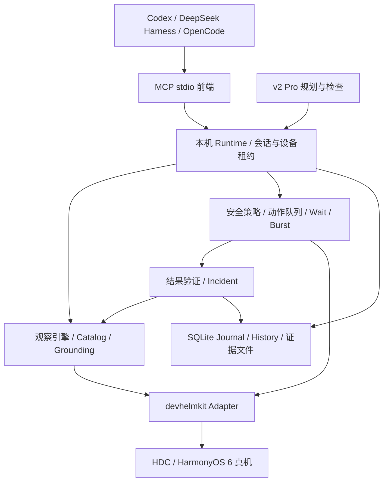

# HarmonyOS Mobile Agent Runtime 最终开发计划

版本：1.0 Final Planning Baseline  
日期：2026-09-18  
目标仓库：BBWTLP/HarmonyOS-to-use  
输入：用户提供的《HarmonyOS Mobile Agent Runtime 完整设计规格与开发计划 v1.0》、原设计文档与本次上游源码核查。  
文档性质：开发执行基线；不是已实现功能清单，也不是设备兼容性证明。

## 1. 最终结论

建设一个运行在 Windows 主机上的 HarmonyOS Mobile Agent Runtime，通过 devhelmkit 控制已授权连接的 HarmonyOS 6.x 真机，通过 MCP 向 Codex、DeepSeek Harness、OpenCode 提供一致的观察和操作能力。外部通用 Agent 负责理解任务和规划，Runtime 负责定位、执行、等待、校验、故障记录和恢复支持。

先交付 Direct MCP 可用闭环，再交付具备 Flash 风格快速执行与长任务支持的 v1；独立内部 Planner/Operator/Checker 作为 v2 Pro 开发。v1 不强制增加第二套模型规划循环。这样用户可以较早直接通过现有 Agent 操作手机，后续性能与可靠性建设也不会被内部 Agent 开发阻塞。

计划按一名具备 Python、自动化和异步服务经验的全职开发者估算：MVP 基础工作量 20 人日，完整 v1 累计 60 人日，另留 12 人日兼容性与稳定性缓冲，合计约 14–15 个工作周。v2 Pro 追加 20 人日开发和 5 人日缓冲，约 5 个工作周。MVP 包含在 v1 内，不重复计费。单人连续实施全部范围合计 97 人日，约 19–20 个工作周。这里是工程估算，不是外部项目数据或交付承诺；M0 真机结果出来后重估。

开始日期以真机、连接工具和测试账号可用当天为 D1；不把尚未满足的环境条件折算为已开始的日历排期。

## 2. 冻结的技术决策与范围

| 决策 | 最终方案 | 开发约束 |
|---|---|---|
| 宿主 | Windows 优先、Python 3.11+，M0 锁定具体小版本 | 本期不承担三种桌面系统同时验收 |
| 驱动 | devhelmkit 唯一设备适配器；HDC 为连接前提 | Runtime 不直接泄漏驱动对象；上游不支持的能力显式返回 unavailable |
| 依赖 | 锁定已验证版本/提交、SDK 与 HDC 版本 | 升级必须回归，不能依赖浮动 latest |
| 对外接口 | MCP，先 stdio | 本期不建设公网远控、账号服务或远程 HTTP 部署 |
| 运行进程 | 多个轻量 MCP 前端连接一个本机 Runtime 服务 | 设备连接由 Runtime 独占；前端探测/退出不得反复初始化真机 |
| 设备并发 | 每台设备一个执行队列和一个写租约 | 三个客户端可轮流控制，同一时刻仅一个写会话 |
| 数据 | SQLite 元数据和动作日志 + 本地文件证据 | 支持保留期限、脱敏和磁盘配额 |
| 观察 | FAST / FULL / TEMPORAL | FAST 不依赖 OCR/VLM；FULL 按需增强 |
| 定位 | 树结构优先，OCR/CV/视觉按需降级 | 不承诺任何第三方 App 都有完整可访问树 |
| 行为 | 真实前台触控、输入、返回与应用切换 | 不要求私有业务 API，不绕过系统授权、登录或订阅限制 |
| 模型 | Direct/v1 使用宿主 Agent 的模型 | Runtime 侧 VLM 是可选增强，有单独费用/授权/超时配置 |
| WebView | 可用时增强 | 零调试权限的第三方 WebView 不作为 DOM 可访问保证 |
| UI | CLI 诊断、日志和回放文件 | v1 不开发大型 Web 控制台 |

参考 Artemis 的执行思想和分层；不移植 Android 驱动，不以 Artemis 的 Android 成功率或延迟当作 HarmonyOS 指标。已有源码核查可支持技术路线候选，但尚未完成 HarmonyOS 6 真机证明。[S1][S2]

## 3. 对输入规格的最终修订

这些修订用于消除实施中的矛盾，其余功能目标沿用输入规格。

1. **安全与日志提前。** 原规格后置的安全网、执行前日志、基本错误分类、最小 Action Catalog 必须在首个可写 MCP 版本前具备。完整安全策略、历史检索和回放随后增强。
2. **四个基础工具名称统一。** 使用 `mobile_session`、`mobile_observe`、`mobile_act`、`mobile_wait`；先前研究草稿中的 `phone.*` 不作为实现契约。
3. **Burst 不复用旧页面目标。** 页面改变后，后续动作必须使用新观察生成的目标或在本地按语义条件重新定位；旧 action_id 不能继续点击新页面位置。
4. **TEMPORAL 必须服务实时执行。** 历史截图可以解释瞬时浮层，不能追回已消失的控件。需要本地检测、命中即执行、过期即停止；50/150/300/700/1500ms 是候选采样时间点，不是已保证的能力。
5. **事件只能按恢复证据关闭。** 任意一次后续操作成功不能消除之前的失败；必须满足该 incident 的恢复条件。
6. **不确定写入禁止盲重试。** 断连发生在点击之后时返回 execution_unknown；先观察与核对，不把超时等同于未执行。
7. **100+ 步必须验证任务质量。** 不能通过重复返回/点击凑计数；需跨阶段目标、压缩、历史取回和最终事实验证。
8. **性能数值改为待实测目标。** 驱动、截图传输、App 动画和外部模型耗时分别统计；不能承诺整个复杂任务毫秒完成。
9. **原始证据不是永久保留。** 元数据、截图、输入内容分级设置保留策略；公开回归材料使用测试账号和测试数据。
10. **接入能力与图像能力分开验收。** MCP 能调用工具不代表当前模型可读截图。文本模型可以使用树/OCR，但视觉盲区必须明确报告。[S3–S5]

## 4. 最终架构与模块责任

建议目录：`src/harmony_runtime/{contracts,device,session,observation,grounding,execution,safety,verification,history,mcp,diagnostics}`；Pro 置于独立 `pro` 模块；测试分 `unit`、`contract`、`fault_injection`、`device`、`benchmark`。不要求按目录数量建立多个服务。

| 模块 | 输入与输出 | 责任边界 |
|---|---|---|
| DeviceAdapter | 截图、树、设备能力、输入命令及明确错误 | 隔离 devhelmkit，驱动版本与协议异常可诊断 |
| SessionManager | device_id → session_id、租约、状态 | 配对、心跳、独占、暂停、关闭与断线恢复 |
| ObservationEngine | 模式与预算 → observation_id、时间、树、图片、指纹 | 截图与树分别记录采集时间；不同步超过阈值则标记不一致并重采 |
| Catalog/Grounding | 当前观察 + 意图/目标 → 唯一候选、置信度及来源 | 同文案多控件不能静默选第一个；坐标有屏幕与旋转变换 |
| ActionExecutor | 合法动作 → dispatch 状态、验证结果与证据 | 执行唯一入口；串行、幂等记录、取消边界 |
| Wait/Burst | 有界条件/动作序列 → 命中或部分完成 | 本地确定性执行，无任意 Python、shell 或模型生成代码 |
| SafetyEngine | 当前目标、风险、会话策略 → allow/deny/approval_required | 重新定位后重评风险；授权绑定动作对象和有效期 |
| Verification | 预期条件 + 新观察 → verified/failed/inconclusive | “驱动接受”不等于任务成功；Pro Checker 同样无写权限 |
| History/Incident | 有序事件 → 最近上下文、检索、只读回放 | 压缩保留任务约束、未解决故障和证据索引 |
| MCP Frontend | 工具参数 ↔ Runtime 结构化结果与图片 | stdout 仅协议；日志 stderr；探测连接无设备副作用 |

本机服务仅对当前用户开放，使用本机 IPC 或回环地址加随机凭据；凭据放用户私有配置，不能出现在截图和普通日志中。启动器负责单实例发现和版本握手，避免三个 Agent 分别争抢 HDC/设备守护进程。

## 5. 接口基线和执行不变量

| 版本 | 工具 | 契约摘要 |
|---|---|---|
| MVP | mobile_session | open/status/pause/resume/close；只有唯一可用设备时才允许 auto，多个设备返回列表要求选择 |
| MVP | mobile_observe | FAST 起步；返回 observation_id、采集时间、屏幕尺寸/旋转、能力与新鲜度 |
| MVP | mobile_act | 点击、长按、滑动、输入、返回、主页、启动应用；统一 typed schema |
| MVP | mobile_wait | 条件、超时、轮询预算；必须可取消，禁止无限等待 |
| v1 | mobile_burst | 最多 5 动作、3000ms 候选上限；返回逐步状态和停止原因 |
| v1 | mobile_history | 分页检索事件、失败、任务阶段与证据 |
| v1 | mobile_replay | 只读展示历史截图和结果，绝不重放真实点击 |
| v1 | mobile_inspect | 局部树/截图/候选诊断，不开放 shell |
| v2 | mobile_run_task / mobile_task_status / mobile_task_cancel | 异步 Pro 任务，复用 v1 所有执行规则 |

每次动作携带 `session_id, request_id, observation_id, action, target, expected, timeout_ms`；无目标动作如返回允许省略 target，但仍检查会话与当前状态。action_id 是 observation 内的引用，不是永久业务 ID。

返回至少包含 `status, execution_status, verification_status, before_observation_id, after_observation_id, timing, evidence_refs, incident_id`。错误至少覆盖 `device_unavailable, lease_conflict, stale_observation, target_ambiguous, target_not_found, unsupported_capability, approval_required, timeout, cancelled, execution_unknown`。

执行顺序：参数检查 → 租约检查 → 页面新鲜度 → 重新定位 → 当前目标风险判断/授权 → 前置条件 → Journal 写入 prepared → 下发 → 记录 dispatched → 新观察 → 后置验证 → 记录完成或 incident。

同一 session 的 request_id 重复请求：参数完全一致则返回已记录结果或当前状态；参数不同则冲突。系统崩溃后处于 prepared/dispatched 边界且无完成证据的请求按 unknown 处理。不能宣称外部物理动作“恰好一次”；目标是可追踪、不盲目重复。

R0 只读、R1 普通导航默认允许；R2 修改设置/数据按会话策略；R3 付款、发送消息、提交订单、删除等不可逆或对外行为需要可信用户授权。模型传入 `approved=true` 不构成授权。MVP 可直接禁止 R3，后续通过 Runtime 可信本地交互签发绑定目标、参数、期限的一次性授权。安全分类不能保证理解所有未知 App，存在不确定性时停止高影响写入。

暂停与取消：立即拒绝后续动作并清空未开始队列；已发出的触控无法撤销，需记录结果并重新观察。人手触控导致页面变化时使旧目标失效并重新定位。页面内文字、广告和弹窗是被观察数据，不可更改 Runtime 安全策略。

## 6. 版本范围与发布门槛

### MVP：通用 Agent 已能实际操作手机

包含单台 HarmonyOS 6 真机、设备诊断、常驻会话、四工具、FAST 截图/树、最小目标列表、基本语义定位、等待、过期拒绝、执行日志和断连错误处理；完成 Codex 首个端到端接入。默认不允许高风险写入。

验收：三类导航任务各重复 10 次，任务成功至少 27/30；无错误成功报告、无已知安全边界绕过；预设的 stale、重复 request_id、断连、取消、租约冲突测试全部通过。任务至少包括设置导航、浏览器访问测试页面、视频 App 查找历史。视频账号无历史时返回可验证的“历史为空”，不能伪造继续播放成功。

### v1：Flash 风格通用执行能力

增加 FULL/TEMPORAL、Catalog/SoM、OCR/CV/可选视觉、实时有界 Burst、可靠验证、Incident、检索和只读回放、上下文压缩、三个客户端验收，以及 50/100+ 步跨页跨 App 测试。

Release Gate：本计划第 9 节全部通过；对外只声明通过矩阵内的设备/OS/客户端能力，不声称全部 HarmonyOS 6 手机或全部应用兼容。纯视觉目标可由具备图像输入的外部 Agent 从当前截图选择，Runtime 仍检查新鲜度与风险；可选内部 VLM 关闭时明确展示能力差异。

### v2 Pro：独立长任务服务

增加内部 Planner/Operator/只读 Checker、living plan、检查点、预算与停止条件、异步状态/取消、重规划、最终独立验证。需要配置 Runtime 自己的模型服务，不能默认复用外部客户端订阅凭据。是否并入首发由用户业务需求决定，本基线不将其放在 v1 关键路径。

## 7. 阶段、工期与依赖

所有人日包含实现与本阶段验证。默认同一工程师顺序承担，实现角色为 E；测试/验收角色为 Q，可由同一人承担，但验收结果独立记录。用户角色 U 提供设备、授权连接、测试账号与最终场景确认，不默认占用开发人日。

| 阶段 | 人日 | 累计 | 核心交付物 | 通过条件 |
|---|---:|---:|---|---|
| M0 真机可行性与契约 | 5 | 5 | capability report、依赖锁定、接口草案、基线数据 | 截图、树、输入、返回、应用切换在目标真机可行；失败明确分级 |
| M1 常驻设备与安全执行底座 | 7 | 12 | Adapter、Runtime、写租约、Journal、typed action、最小风险策略 | 重复请求不重复派发；断连/崩溃不盲重试；多客户端不能同时写 |
| M2 四工具与首个通用闭环 | 8 | 20 | FAST、最小 Catalog/Grounding、MCP、Codex 接入、MVP | 三类任务 27/30，关键故障用例全通过 |
| M3 稳健定位与验证 | 10 | 30 | FULL、SoM、OCR/CV、视觉降级、校验、Incident | 代表性目标定位≥90%；歧义不静默点击；恢复按证据闭环 |
| M4 瞬时界面与性能 | 9 | 39 | TEMPORAL、watch、burst、帧缓存、分段性能报告 | 瞬时目标场景≥27/30；过期目标拒绝；满足或正式修订候选 SLO |
| M5 长任务与证据 | 9 | 48 | history/replay、压缩、检查点数据、50/100+步任务集 | 长任务门槛通过；压缩后保留关键事实并能取回原证据 |
| M6 三客户端与发布可靠性 | 7 | 55 | DeepSeek Harness/OpenCode 接入、安装诊断、完整回归 | 三客户端协议/图像能力矩阵与同一任务集结果齐备 |
| M7 v1 发布收口 | 5 | 60 | 可安装包、示例配置、演示、已知限制、兼容矩阵 | 干净主机可按文档安装；发布门槛通过；无未解决阻断缺陷 |
| B1 v1 缓冲 | 12 | 72 | 修复兼容性/稳定性缺陷及回归 | 不用于偷偷增加新范围 |
| P0–P4 Pro | 20 | 92 | 任务服务、规划/执行/检查与评测 | 与 v1 同场景对照，复杂任务达标且预算有界 |
| B2 Pro 缓冲 | 5 | 97 | Pro 故障修复与发布 | v2 发布门槛通过 |

关键路径：M0 → M1 → M2 → M3 → M4 → M5 → M6 → M7；Pro 依赖 v1 执行契约稳定。测试夹具、协议测试、性能埋点从 M0/M1 开始，不等到末尾统一补测试。第二开发者可承担测试数据、客户端接入和文档，但整体工期不能简单除以二；单设备访问仍受串行约束。

M0 分支决策：
- 基础能力通过：按基线推进。
- 树在部分 App 缺失：明确视觉降级范围，继续推进，并把对应测试纳入 M3。
- 所选真机无法稳定截图或输入：暂停功能堆叠；定位 SDK/ABI/协议问题，评估上游最小修复。修复超过缓冲可覆盖范围时重新排期。
- 本机适配需要替换核心驱动：这是架构变更，必须提交 ADR 和新的成本评估，不隐式引入第二套驱动。

## 8. 前十个工作日

| 日 | 具体工作 | 当日可审查结果 |
|---|---|---|
| D1 | 整理仓库、明确目标手机型号/完整 OS build、开发者模式、USB 授权、HDC/SDK 版本 | 环境清单与连接诊断报告 |
| D2 | 探测 ABI、驱动协议、截图/树、基础点击/返回/输入 | 原始结果与明确 capability flags |
| D3 | 应用切换、中文输入、键盘、旋转、重复观察采样 | 首轮延迟分布及失败样本 |
| D4 | 连续连接、断线重连、守护进程失败与版本解析失败 | go/no-go 风险清单 |
| D5 | 冻结驱动版本、数据契约、错误码、设备矩阵 | M0 评审记录与修订排期 |
| D6 | 建立 Adapter、设备会话状态机和模拟驱动夹具 | 可替换 Adapter 与状态转换测试 |
| D7 | 常驻 Runtime 与本机认证、单实例启动和租约 | 两个前端争用时仅一个写入 |
| D8 | typed actions、request_id、执行前日志 | 重复请求、冲突请求均可复现 |
| D9 | 新鲜度校验、R0/R1 策略、高风险默认禁止 | 旧截图/危险动作被拦截 |
| D10 | 断连/超时/崩溃 unknown 分类与取消 | 无自动重复未知写入的故障报告 |

D11–D12 完成 M1 整体验收；D13–D20 完成 M2。首周不以实现内部 Planner 或美化控制台作为进度。

## 9. 验证、性能与量化标准

### 9.1 性能口径

以下均为候选工程目标，M0 采基线、M4 作出达成或范围调整决定。不得只报告平均值。

| 指标 | 候选目标 | 计时边界 |
|---|---|---|
| MCP 本地额外开销 | P50 <30ms | 请求解码/排队/编码，扣除 Runtime 实际操作时间；冷启动另报 |
| 动作派发 | P50 <150ms，P95 <300ms | 通过全部校验后，到驱动返回派发结果；不代表 UI 稳定 |
| FAST observation | P50 <800ms，P95 <1500ms | 请求到截图+树+最小 Catalog 可用，包含实际传输与序列化 |
| Burst 相邻动作间隔 | 同屏已定位目标尽量 <100ms | 仅报告测得分布；跨页重新定位不套用此目标 |
| FULL / TEMPORAL | 首轮只建立预算和分段基线 | 单独报告 OCR/视觉/采样耗时，不纳入 FAST 冒充达标 |
| Agent 完整一步/任务 | 报 P50/P95、成功率、模型调用数与成本 | 包含外部模型、网络、App 加载、授权等待的分项 |

性能用同一设备、OS、SDK、连接方式、分辨率和应用版本测量；预热后每项至少 200 样本，冷启动至少 20 样本。失败与超时保留在分母中，单列数量与截止时间，不从报表剔除。记录 CPU、内存、连接重建次数、截图体积、树节点数和缓存命中。

优化次序：常驻连接 → 减少重复截图/树读取 → 局部树/裁剪图 → 事件或自适应轮询 → 本地 burst → OCR/视觉触发控制。优先减少模型往返和重复 I/O，不通过省略安全校验制造速度提升。

### 9.2 v1 功能任务集

| 编号 | 场景 | 重复与通过门槛 |
|---|---|---|
| T01 | 设置 → 蓝牙页面 → 主页，仅导航 | 10 次，至少 9 成功 |
| T02 | 浏览器打开已知测试页并跟随指定链接 | 10 次，至少 9 成功 |
| T03 | 图库打开测试照片、查看并返回 | 10 次，至少 9 成功 |
| T04 | 视频观看历史 → 播放 → 唤起控制栏 → 打开清晰度菜单 | 30 次，至少 27 成功；可用时选择指定档位，否则准确报告不可用 |
| T05 | 跨至少 3 个 App、50+有效动作的多阶段任务 | 5 次，至少 4 成功 |
| T06 | 跨至少 3 个 App、100+有效动作，包含压缩及历史回查 | 5 次，至少 4 成功；最终所有子目标有证据 |
| T07 | 插入网络慢、弹窗、错误页面、目标消失等恢复条件 | 20 个受控用例，至少 18 正确恢复或按预期安全停止；分别报告恢复率与停止率 |
| T08 | 未见过的页面布局/文案变化，不增加 App 专用流程 | 至少 10 个保留用例，至少 8 成功，并报告失败类型 |

这些数值是内部发布门槛，小样本不能解释为真实世界成功率保证。成功、业务不可用、系统失败、安全停止分别标记；T01–T06 的安全停止不能算任务成功。测试 reset 夹具可以固定，正式任务执行不允许依赖为该 App 编写的导航工作流。

### 9.3 不能以成功率抵消的硬门槛

所有预设的租约争用、过期观察、重复写入、取消、授权伪造、风险目标替换、未知执行结果用例必须通过；结果不能虚报为已完成。三客户端各运行 10 次同一短任务，至少 9/10，协议发现、结构化错误、图片或能力降级、超时、取消和进程探测分别验收。

设备至少覆盖主目标真机；若没有第二台设备，只发布单设备验证声明。持续会话 2 小时、10 次受控断连/重连、Runtime 重启与磁盘配额耗尽均需给出结果；重连后重新观察，禁止自动重放先前动作。发布阻断定义为设备不可用、未授权写入、重复高影响动作、证据丢失造成虚报完成或关键流程不可复现。

## 10. 客户端接入实施要求

- Codex：作为 M2 首个接入客户端；按已安装版本的官方 MCP 配置验证本地服务发现、工具调用、图片结果和超时。M6 固化可复制配置与版本记录。[S3]
- DeepSeek Harness：使用官方 `deepseek-ai/deepseek-harness` 中的 `@deepseek-ai/dsh-mcp-client`。文档说明 stdio 探测会启动临时进程，因此初始化不得连接或改变手机。图像需要支持图像输入的模型及 attachment 功能；缺少条件时显示降级能力，不当作完整视觉兼容。[S4]
- OpenCode：核查到 V2 文档使用 `mcp.servers`；不能直接复用旧版本配置格式。安装版本、配置层级、协议协商、工具暴露方式纳入接入测试。[S5]

Pro 的 run/status/cancel 使用普通 MCP 工具加应用层 task_id，不依赖 MCP task-required 扩展；已核查 DeepSeek Harness 当前未实现该扩展。[S4]

三个客户端共享工具 schema，但各自配置独立。MCP 协议版本由 SDK 协商并记录；初版选择三者已验证的公共能力，不为追求新协议版本增加兼容性风险。其他 MCP 客户端不在首发强制验收范围。

## 11. Pro 追加计划

| 任务 | 人日 | 验收 |
|---|---:|---|
| P01 异步任务状态、预算、暂停/取消与模型配置 | 4 | 客户端断开任务可查询，重连不重复创建；超预算停止 |
| P02 Planner 与 living plan、检查点 | 5 | 每个子目标有完成条件，重规划保存变更原因 |
| P03 Operator 与只读 Checker | 5 | Checker 无动作权限；检查失败不能直接标完成 |
| P04 恢复、历史召回与 Direct/Pro 对照评测 | 4 | 同一 T05/T06 任务各 5 次至少 4 成功；报告成本、耗时及相对 v1 的变化 |
| P05 打包、文档与发布回归 | 2 | run/status/cancel 全链路通过，模型费用与凭据边界明确 |

Pro 不因使用多个角色就认定优于 Direct。若复杂任务成功率不改善或耗时/费用显著增加，应继续作为实验功能，不阻碍稳定的 v1 发布。

## 12. 风险、资源与变更管理

开始前必需：目标 HarmonyOS 6 真机及数据线、授权开启调试环境、可用 HDC/SDK、允许自动化的测试账号和内容、已安装的至少一个目标 Agent。M3 需要可读图像的外部模型或明确接受视觉降级；可选内部 VLM 另行配置，密钥不进仓库。

最大风险是 OS/设备/驱动协议差异，其次是 UI 树缺失、输入法差异、瞬时控件短于观察链路、外部模型延迟和未知 App 风险识别。每周回顾风险清单，缓冲优先用于这些风险；超出缓冲则缩范围或改日期，不能减少安全和真实性验收。

每个任务完成条件：代码与必要测试、对应文档/配置、实际结果与日志路径、未解决限制、兼容矩阵更新。关键架构改动以 ADR 记录。里程碑结束保存基准报告和可安装版本，避免只有演示录像没有可重复结果。

仓库建议新增 `docs/plan`、`docs/adr`、`docs/compatibility`、`benchmarks`、`examples/clients`；本次交付仅生成本地规划文件，尚未修改或推送远程仓库。

## 13. 可追溯性与资料边界

| 输入规格主题 | 落地位置 |
|---|---|
| 设备/会话/进程 | M0/M1 |
| FAST 与四工具 | M2 |
| FULL、Catalog、SoM、Grounding、视觉/WebView 能力探测 | M3 |
| TEMPORAL、语义动作、Burst、Wait | M2 基础等待 + M4 增强 |
| 安全/验证/Incident | M1 最小底座 + M3 完整闭环 |
| Ledger/History/Replay/压缩 | M1 Journal + M5 完整能力 |
| 三客户端 | M2 首个客户端 + M6 全部 |
| Pro Runtime | P01–P05 |
| Benchmark/可观测性 | M0 起持续埋点，M4/M5/M6 正式验收 |

输入规格是需求与设计依据，本文对其中实施顺序、性能承诺和不一致规则作出上述修订。此前 `设计规格与架构设计_v2.0.md`、`开发任务清单_v2.0.csv` 为研究草稿；发生冲突以本文和同目录最终 CSV 为执行基线。

资料核查日：2026-09-18。以下为上游能力依据，不代表本项目已经接入成功：

- [S1] Google Artemis 仓库；本地核查提交 `371aa6df56880643da57b30da936e9812fb0ec66`。参考 Android 自动化架构、Flash/Pro 思路及任务运行机制。
- [S2] yabi-zzh/devhelmkit 仓库；本地核查提交 `05c9bc0f7f9ea763d61c8b4b5d1cfbb076626b00`。参考 Harmony 驱动、协议探测、截图/树/输入封装。源码的协议分支不能替代 HarmonyOS 6 实测。
- [S3] OpenAI 官方 Codex MCP 文档，检索页 `developers.openai.com/codex/mcp`，当前跳转到官方 ChatGPT Learn MCP 文档。
- [S4] deepseek-ai/deepseek-harness，`packages/mcp/mcp-client/README.md`，核查 stdio/HTTP、进程探测与图像输入条件。
- [S5] OpenCode 官方 V2 MCP servers 文档，`opencode.ai/v2/docs/mcp-servers`，核查本地服务、配置层级及协议行为。
- [U1] 用户提供 `D:/Downloads/HarmonyOS_Mobile_Agent_Runtime_Design_Spec_and_Development_Plan_v1.0.md`。

目前没有真机兼容性、延迟、成功率或长任务实测结果。M0 是可实施性验证门槛，不是可以跳过的形式流程。

